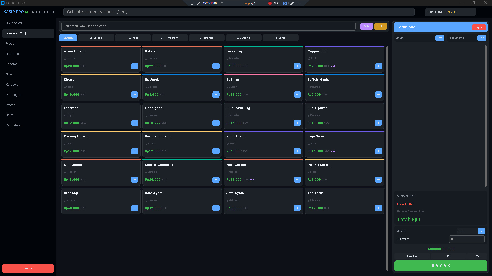
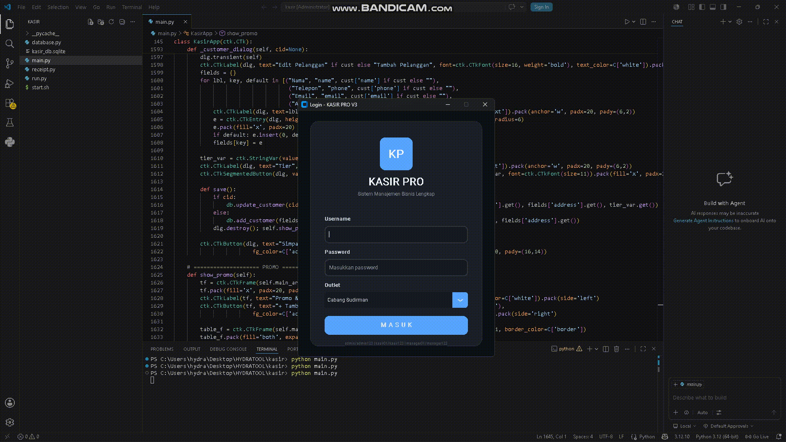

  

  

# 🛒 Aplikasi Kasir

Aplikasi Kasir modern yang dibangun menggunakan Python untuk membantu pengelolaan produk, transaksi penjualan, laporan, dan manajemen data secara efisien.

## ✨ Fitur Utama
- Manajemen Produk
- Transaksi Penjualan
- Laporan Penjualan
- Database Terintegrasi
- Interface Modern dan Mudah Digunakan

## 💻 Jasa Pembuatan Aplikasi

Menerima pembuatan aplikasi dan custom software dengan berbagai bahasa pemrograman:

- Python
- Java
- JavaScript
- TypeScript
- PHP
- C#
- C++
- VB.NET
- Go (Golang)
- Ruby
- Kotlin
- Swift
- Flutter
- React
- Node.js
- Laravel
- Django

### 📌 Bisa Request:
- Aplikasi Desktop
- Website
- Sistem Informasi
- POS / Kasir
- CRM
- ERP
- AI Assistant
- Bot Otomatisasi
- Dashboard Admin
- API Development
- Custom Software

### 📱 Konsultasi & Pemesanan
WhatsApp: +62 877-6479-8112
